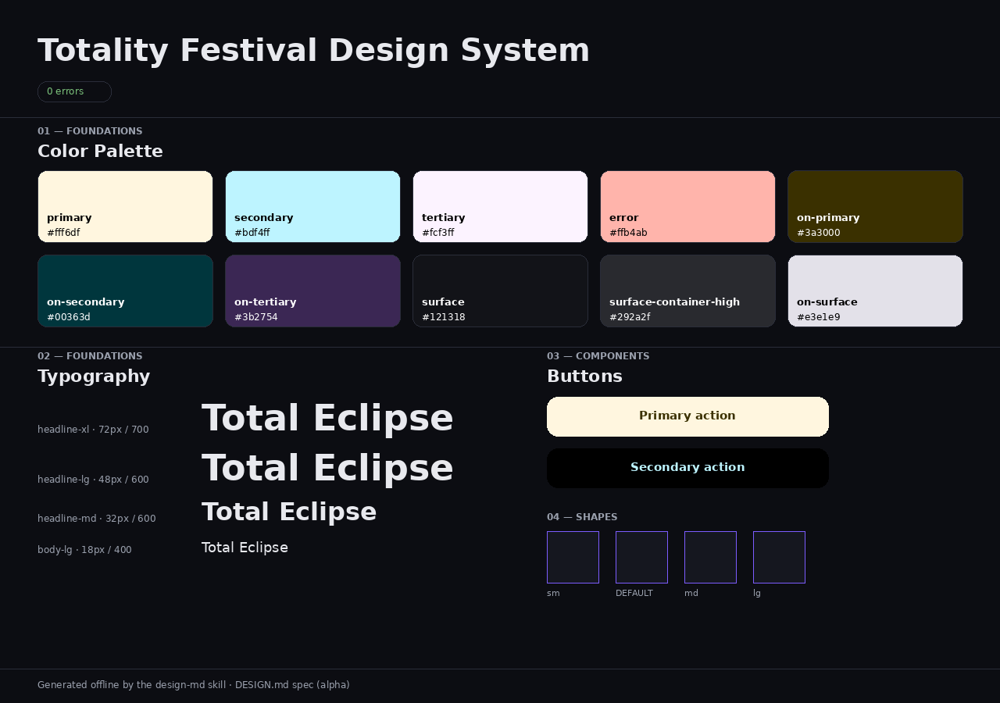

# design-md — a DESIGN.md toolkit skill (no CLI required)


Create, validate, update, preview, and export **DESIGN.md** files — entirely
through a self-contained skill. **No `npm install`, no Node, no network.**

> **DESIGN.md** is a format ([google-labs-code/design.md](https://github.com/google-labs-code/design.md),
> *"Built on Google's DESIGN.md spec"*) that gives AI coding agents a structured,
> persistent understanding of a design system: machine-readable **design tokens**
> in YAML front matter + human-readable **rationale** in Markdown prose.

This is a [skill](https://docs.claude.com) for Claude (Cowork / Claude Code).
Point Claude at a request like *"make a DESIGN.md for my app"* or *"is my design
tokens file valid?"* and it uses the bundled scripts to do the work.



> *The self-contained HTML live preview (`python scripts/preview.py DESIGN.md`)
> renders the palette, type scale, components, and shape scales straight from the
> tokens — no build step, no remote assets.*

---

## Why this exists

The official `@google/design.md` CLI is great, but using it means installing an
npm package and running a Node binary (with some Windows `.md`-association
footguns). For an agent that just needs to **author, check, and convert** a
DESIGN.md, that's friction.

This skill removes the dependency. The entire toolchain is reimplemented in
**pure Python (standard library only)** and runs offline:

- ✅ **No CLI install** — `npx @google/design.md` is not needed.
- ✅ **No Node, no npm, no internet** — scripts use only the Python stdlib.
- ✅ **Faithful** — output is verified **byte-for-byte against the official CLI**
  on the official example files (lint, diff, and all export formats) and ships a
  28-check self-test.
- ✅ **More than validation** — it also *creates* a DESIGN.md from scratch or by
  scanning an existing project, *updates* one, renders a *live HTML preview*, and
  offers a *catalog* of 74 reference design systems.

If you happen to have Node installed, you can still cross-check against the real
CLI (`diff <(npx -y @google/design.md lint DESIGN.md) <(python scripts/dmd.py lint DESIGN.md)`)
— but you never need to.

---

## Install

**As a packaged skill:** install `design-md.skill` from your Claude app's skills
UI (or run the bundled packager to produce it).

**As a folder (Claude Code / Cowork plugins):** drop this directory into your
skills location so `SKILL.md` is discoverable.

**Standalone scripts:** you can also just run the scripts directly — they have no
dependencies:

```bash
python scripts/dmd.py selftest          # 28 offline checks, no Node/network
```

Requires Python 3.8+.

---

## What it does

| Goal | Command |
| ---- | ------- |
| **Validate / lint** a DESIGN.md | `python scripts/dmd.py lint DESIGN.md` |
| **Diff** two versions (with regression check) | `python scripts/dmd.py diff OLD.md NEW.md` |
| **Export** tokens | `python scripts/dmd.py export --format css-tailwind DESIGN.md` |
| **Print the spec / rules** | `python scripts/dmd.py spec --rules` |
| **Create** from a token spec | `python scripts/scaffold.py new --from-json spec.json --out DESIGN.md` |
| **Scan a project** into a draft spec | `python scripts/scaffold.py scan ./my-app --json` |
| **Update** an existing file | `python scripts/scaffold.py update DESIGN.md --from-json changes.json` |
| **Live preview** (self-contained HTML) | `python scripts/preview.py DESIGN.md -o preview.html` |
| **Browse the catalog** | `python scripts/catalog.py search fintech` |

Export formats: `json-tailwind` (Tailwind v3 `theme.extend`), `css-tailwind`
(Tailwind v4 `@theme`), `dtcg` (W3C Design Tokens). Validation reproduces the
nine upstream lint rules — broken references, WCAG AA contrast on component
color pairs, missing primary/typography, orphaned tokens, section order, unknown
keys — with identical messages and severities. The linter exits non-zero on
errors so it drops into CI cleanly.

### Examples

```bash
# Lint and see JSON findings + summary
python scripts/dmd.py lint assets/examples/paws-and-paths.md

# Convert tokens to a Tailwind v4 theme
python scripts/dmd.py export --format css-tailwind DESIGN.md > theme.css

# Render a browsable preview of the palette, type scale, and components
python scripts/preview.py DESIGN.md
```

---

## The format in 30 seconds

```markdown
---
name: Heritage
colors:
  primary: "#1A1C1E"
  on-primary: "#ffffff"
typography:
  h1: { fontFamily: Public Sans, fontSize: 3rem, fontWeight: 700 }
rounded: { sm: 4px, md: 8px }
spacing: { sm: 8px, md: 16px }
components:
  button-primary:
    backgroundColor: "{colors.primary}"
    textColor: "{colors.on-primary}"
    rounded: "{rounded.sm}"
---

## Overview
Architectural minimalism meets journalistic gravitas.

## Colors
- **Primary (#1A1C1E):** deep ink for headlines and core text.
```

Tokens are normative; prose explains *why*. See [`references/spec.md`](references/spec.md)
for the full reference and [`references/linting-rules.md`](references/linting-rules.md)
for how to read findings.

---

## Repository layout

```
design-md/
├── SKILL.md                 # how Claude uses the skill (workflows)
├── scripts/
│   ├── dmd.py               # core engine: parse / lint / diff / export / spec / selftest
│   ├── scaffold.py          # create / update / scan-a-project
│   ├── preview.py           # self-contained HTML live preview
│   ├── catalog.py           # offline catalog index browser
│   └── selftest.py          # 28 offline checks
├── references/
│   ├── spec.md              # condensed DESIGN.md spec (v alpha)
│   ├── linting-rules.md     # the 9 rules + WCAG contrast math
│   └── security.md          # safety properties to preserve
├── assets/
│   ├── examples/            # 3 official example DESIGN.md files (fixtures)
│   └── catalog-index.json   # 74 reference design systems (slug → fetch URL)
└── evals/                   # test prompts + fixtures for evaluating the skill
```

---

## Security

The scripts are offline and dependency-free. Project scanning is read-only,
bounded, and never follows symlinks out of the target. The HTML preview escapes
all document values, validates anything entering a `style` attribute against an
allow-list, ships a strict `Content-Security-Policy`, and contains no JavaScript
or remote assets. Details in [`references/security.md`](references/security.md).
Never put secrets in a DESIGN.md — it's meant to be committed and shared.

---

## Status & compatibility

The DESIGN.md format is at version **`alpha`** and evolving. This skill tracks
that version; if upstream changes, `scripts/dmd.py` and `references/` are the
single source of truth to update. Fidelity is verified against the official CLI
release used at build time.

## Attribution

- The DESIGN.md **format/spec** and the three files under `assets/examples/` are
  from [google-labs-code/design.md](https://github.com/google-labs-code/design.md),
  Apache-2.0.
- The catalog index references analyses from
  [VoltAgent/awesome-design-md](https://github.com/VoltAgent/awesome-design-md)
  (MIT) and [getdesign.md](https://getdesign.md); it links to them and does not
  redistribute their contents.

This project is independent and not affiliated with or endorsed by Google.

## License

Licensed under the **Apache License 2.0** — see [`LICENSE`](LICENSE) and
[`NOTICE`](NOTICE). You're free to use, modify, and distribute this skill,
including commercially, provided you retain the license and attribution notices.

```
Copyright 2026 Jeftar Mascarenhas
Licensed under the Apache License, Version 2.0.
```
